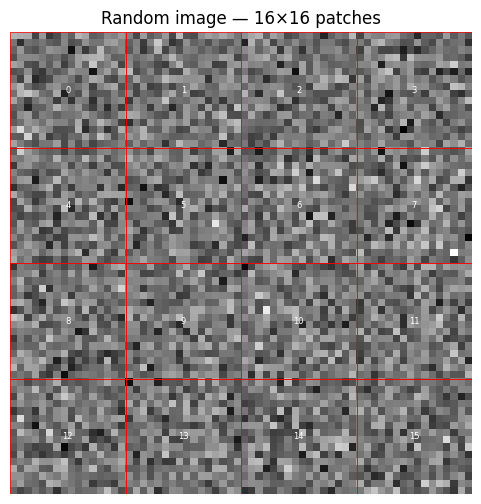
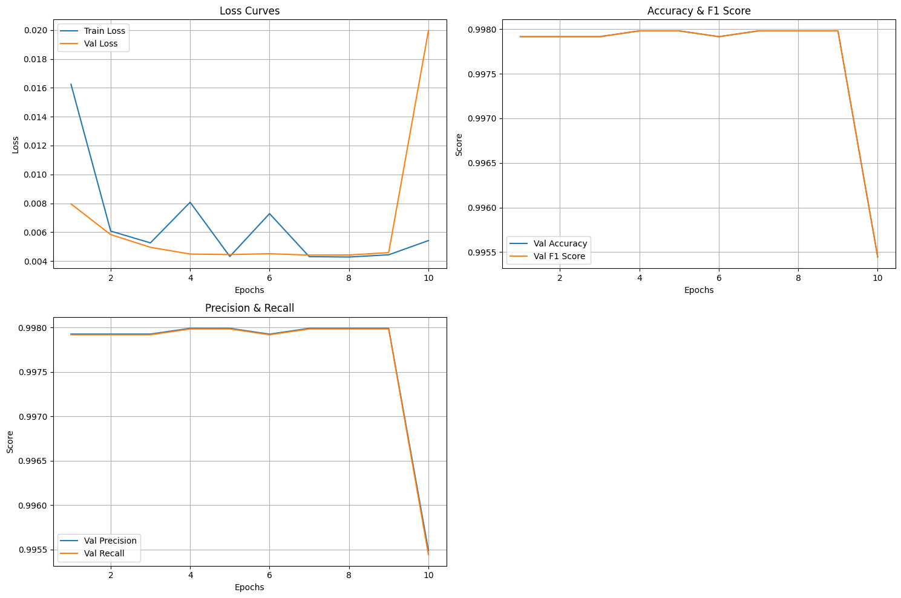
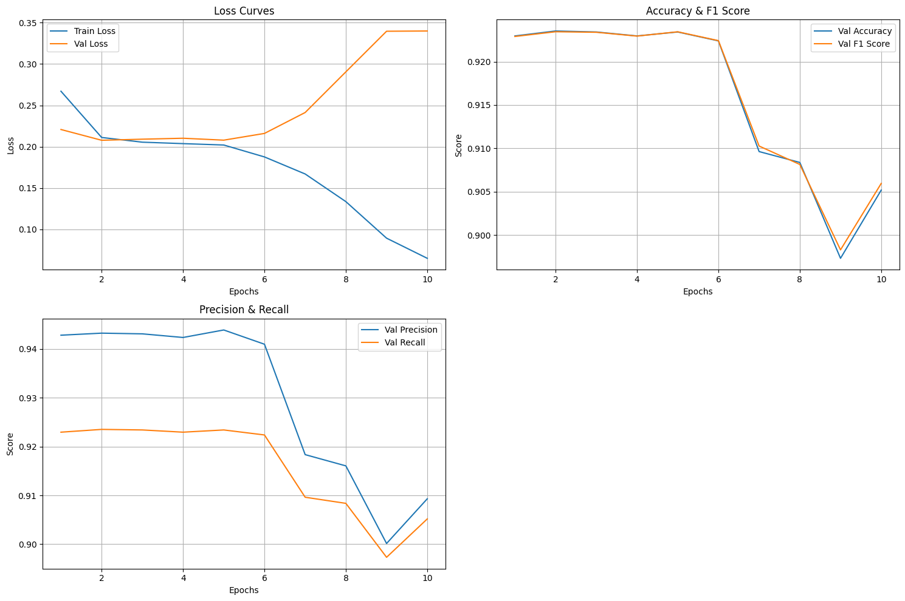

# Encrypted Network Traffic Classification using Vision Transformers and LSTMs

## Sub-group Details

| Name | Roll Number | Sub-group ID |
| --- | --- | --- |
| Tejas Tanmay Singh | 2301AI30 | 5 |
| Ayush Bansal | 2301AI04 | 5 |

## Introduction
The provided codebase implements [ATVITSC](https://ieeexplore.ieee.org/document/10609252), an advanced deep learning pipeline for encrypted network traffic classification. We translate raw network traffic (PCAP files) into 2D image representations and process them using a hybrid architecture that combines Vision Transformers (ViT) and Recurrent Neural Networks (LSTM). The primary objective is to accurately classify encrypted network sessions, demonstrating capabilities in both broad threat detection (benign vs. malware) and granular application identification (multiclass benign traffic).

## Dataset & Preprocessing
**Data Source:** The raw data consists of encrypted network traffic captured in PCAP files. The categories include benign application traffic (BitTorrent, Facetime, Gmail, Outlook, Skype, WorldOfWarcraft) and malware traffic (Miuref, Tinba, Zeus).

**Preprocessing Steps:**
1. **Session Grouping:** Utilizing the `scapy` library, raw packets are parsed and grouped into bidirectional sessions based on a 5-tuple key: Source IP, Destination IP, Source Port, Destination Port, and Protocol (TCP/UDP). Packets are sorted chronologically within each session.
2. **Image Construction:** The `SessionImageDataset` class converts these sessions into fixed-size 2D images. For each session, the payload of up to `n` (16) packets is extracted. Each packet's payload is truncated or zero-padded to exactly `m` (256) bytes. The resulting packet representations are stacked and reshaped into a unified 64 x 64 session image.
3. **Metadata Extraction:** Alongside the payload images, the actual byte lengths of the packets are extracted and padded into an array (using a value of 1501 for padding) to serve as supplementary temporal input.
4. **Data Splitting:** Datasets are shuffled and split into 80% training and 20% validation sets, and batched (size 64) for model ingestion.

Example of a session image:

*Each session is represented as a 64 x 64 image, where each pixel represents the byte value of a packet payload. The image is constructed by stacking the payloads of up to 16 packets (separation highlighted in red), each truncated or zero-padded to exactly 256 bytes.*

## Methodology
We implement the core framework proposed by the paper in the custom PyTorch module `ATVITSC`. It relies on a dual-branch neural network architecture that jointly evaluates payload imagery and packet size sequences:

1. **PVT (Packet-based Vision Transformer):** This branch processes the 64 x 64 session image by creating patch embeddings. Crucially, it incorporates a custom embedding layer for the packet lengths, adding length metadata directly into the image patches before processing them through the Vision Transformer.
2. **STFE (Spatial-Temporal Feature Extractor):** This branch focuses on localized sequence features. It first applies a **ResAtConv** (Residual Attention Convolutional Block) to extract spatial features from the image patches. These compressed features are then passed sequentially into a Bidirectional **LSTM** to explicitly capture the temporal dynamics of the packets within the session.

The latent representations from both the PVT and STFE branches are concatenated and passed through a softmax-based dynamic weighting mechanism, and then through fully connected linear layers to produce the final class logits. The network is trained using the Adam optimizer (Learning Rate: 0.001) and Cross-Entropy Loss.

## Results
We trained models for two distinct classification tasks, and managed to replicate the strong empirical results reported in the paper across both.

### Binary Classification (Benign vs. Malware)
Using a dataset of 76,825 sessions (43,874 benign, 32,951 malware), the model achieved exceptional performance.

At the end of 10 epochs on the training set (80%), the best model (epoch 7) achieved the following performace scores on the validation set (20%):

| Accuracy | Precision | Recall | F1 |
| --- | --- | --- | --- |
| 0.9980 | 0.9980 | 0.9980 | 0.9980 |

Confusion Matrix:

| True Label \ Predicted Label | Benign | Malware |
| --- | --- | --- |
| Benign | 8809 | 0 |
| Malware | 31 | 6525 |

### Multiclass Classification (Benign Applications)
Tasked with distinguishing between encrypted sessions of 6 different benign applications (BitTorrent, Facetime, Gmail, Outlook, Skype, and WorldOfWarcraft), the model showcased strong performance, utilizing a dataset of 43,874 sessions (7517 BitTorrent, 6000 Facetime, 8629 Gmail, 7524 Outlook, 6321 Skype, 7883 WorldOfWarcraft).

At the end of 10 epochs on the training set (80%), the best model (epoch 2) achieved the following performace scores on the validation set (20%):

| Accuracy | Precision | Recall | F1 |
| --- | --- | --- | --- |
| 0.9235 | 0.9433 | 0.9235 | 0.9234 |

Confusion Matrix:

| True Label \ Predicted Label | BitTorrent | Facetime | Gmail | Outlook | Skype | WorldOfWarcraft |
| --- | --- | --- | --- | --- | --- | --- |
| BitTorrent | 993 | 0 | 2 | 498 | 4 | 0 |
| Facetime | 0 | 1128 | 0 | 0 | 0 | 0 |
| Gmail | 8 | 0 | 1561 | 128 | 10 | 0 |
| Outlook | 1 | 0 | 7 | 1521 | 6 | 0 |
| Skype | 0 | 0 | 0 | 0 | 1283 | 0 |
| WorldOfWarcraft | 0 | 0 | 6 | 0 | 1 | 1618 |

## Conclusion
The paper's proposed methodology offers a highly effective approach to encrypted network traffic analysis. By intelligently transforming session packets into structured 2D images, we were able to successfully extract both spatial payload patterns and temporal metadata signatures using the combined PVT and STFE branches of the ATVITSC architecture. The experimental results confirm that this ViT and LSTM-based approach can confidently perform both binary threat detection and complex multiclass network application identification with high accuracy on encrypted traffic.
